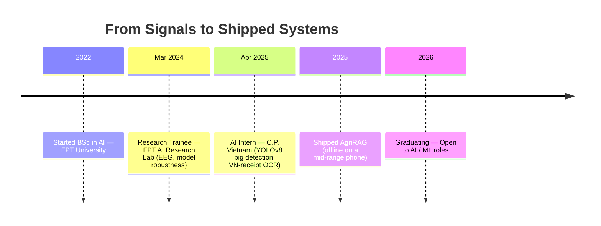

<!-- ===================== HEADER BANNER ===================== -->
<a href="https://dylanvu6868.github.io/">
  
</a>

<!-- ===================== TYPING INTRO ===================== -->
<div align="center">
  <a href="https://dylanvu6868.github.io/">
    
  </a>
</div>

<!-- ===================== BADGES ===================== -->
<div align="center">
  
  
  
</div>

<br/>

<!-- ===================== ABOUT ME ===================== -->
<table align="center">
  <tr>
    <td valign="top" width="58%">

#### 👋 About Me

Final-year **Artificial Intelligence** student at **FPT University**,
working where models meet messy reality.

I work across the full stack of applied AI — from cleaning raw **EEG
signals** in a research lab, to labelling and training **object detectors**
on a food-processing factory floor, to wiring up **hybrid retrieval** so a
language model gives answers it can actually cite.

I care most about the unglamorous parts: the **preprocessing** that makes a
model robust, the **quantisation** that gets it onto a cheap device, and the
**evaluation** that proves it works.

```yaml
name:      Vu Hai Duong (Dylan Vu)
location:  Xuan Mai, Hanoi 🇻🇳
focus:     Computer Vision · RAG · On-device ML
stack:     Python · PyTorch · FastAPI
languages: [Vietnamese, English (B2), Japanese]
motto:     "Get models out of the notebook."
```

  </td>
  <td valign="top" width="42%">

#### 📌 At a Glance

| Metric | Value |
|---|---|
| 🎯 Test acc · AgriRAG | **99.0%** |
| ⚡ On-device latency | **74 ms** |
| 🎓 CGPA | **3.42 / 4.0** |
| 🏆 Excellent Student | **Fall 2025** |

#### 🌐 Connect

<a href="https://dylanvu6868.github.io/"></a>
<a href="mailto:dylanvu6868@gmail.com"></a>
<a href="https://www.linkedin.com/in/duong-hai-vu"></a>
<a href="https://github.com/dylanvu6868"></a>

  </td>
  </tr>
</table>

<!-- ===================== SNAKE DIVIDER ===================== -->


<!-- ===================== WHAT I BUILD ===================== -->
<h2 align="center">🧠 Three Things I Build Well</h2>

<table align="center">
  <tr>
    <td valign="top" width="33%" align="center">
      <h3>👁️ Computer Vision</h3>
      Detection & recognition pipelines that survive real-world noise — YOLOv8, Vietnamese-receipt OCR, and classification under class imbalance.
      <br/><br/>
      <code>YOLOv8</code> <code>OpenCV</code> <code>PaddleOCR</code> <code>VietOCR</code> <code>EfficientNet</code>
    </td>
    <td valign="top" width="33%" align="center">
      <h3>🔎 LLM + RAG</h3>
      Grounded generation that shows its sources — hybrid dense + keyword retrieval, reciprocal-rank fusion, cross-encoder re-ranking, structure-aware chunking.
      <br/><br/>
      <code>FAISS</code> <code>BM25</code> <code>RRF</code> <code>LangChain</code> <code>LLaMA 3.3</code> <code>RAGAS</code>
    </td>
    <td valign="top" width="33%" align="center">
      <h3>⚙️ ML Engineering</h3>
      Getting models out of the notebook — FP16/TFLite quantisation, latency & memory budgeting for mid-range hardware, FastAPI + SSE streaming.
      <br/><br/>
      <code>PyTorch</code> <code>TensorFlow</code> <code>TFLite</code> <code>Docker</code> <code>FastAPI</code>
    </td>
  </tr>
</table>

<br/>

<!-- ===================== FEATURED PROJECT ===================== -->
<h2 align="center">🚀 Featured Project</h2>

<div align="center">

### 🌾 AgriRAG — Rice Leaf Disease Recognition with RAG

</div>

> Diagnoses **10 rice-leaf diseases** from a photo, then explains the treatment **with citations**.
> EfficientNetB0 + two-stage transfer learning hits **99.01% test accuracy** across 15,023 images
> (Focal Loss + inverse-frequency weighting for a 1.8:1 imbalance). The grounded-answer layer is a
> hybrid RAG pipeline (FAISS + BM25 + RRF + cross-encoder re-rank) over a ~340-page agricultural
> corpus, served by FastAPI + SSE on LLaMA-3.3-70B — **FP16-quantised TFLite, runs offline on a mid-range Android phone.**

<div align="center">

| Macro F1 | Latency (Snapdragon 680) | RAGAS Faithfulness | On-device RAM |
|:---:|:---:|:---:|:---:|
| **0.989** | **74 ms** | **0.91** | **~195 MB** |

<a href="https://github.com/dylanvu6868/AgriRAG"></a>

</div>

<!-- ===================== OTHER PROJECTS ===================== -->
<h2 align="center">🛠️ More Things I've Shipped</h2>

<table align="center">
  <tr>
    <td valign="top" width="50%">
      <h4>🧬 <a href="https://github.com/dylanvu6868/HDD-EEGMagicImage">EEG → Image (CLIP-StyleGAN)</a></h4>
      Turns EEG signals into images — spectrogram/recurrence-plot encoding, then a CLIP-guided StyleGAN scored with FID/IS.<br/>
      <code>PyTorch</code> <code>CLIP</code> <code>StyleGAN</code> <code>EEG</code>
    </td>
    <td valign="top" width="50%">
      <h4>📰 <a href="https://github.com/dylanvu6868/telegram-news-ai-bot">Realtime News AI Bot</a></h4>
      Telegram bot that gathers, de-dupes, ranks & summarises the day's news — pluggable search, Gemini summaries, Docker + systemd.<br/>
      <code>Gemini</code> <code>Tavily/Brave</code> <code>Docker</code>
    </td>
  </tr>
  <tr>
    <td valign="top" width="50%">
      <h4>🎭 Deepfake Detection</h4>
      Classifies video as real or manipulated, with dedicated face extraction to lift reliability on facial-forgery datasets.<br/>
      <code>TensorFlow</code> <code>OpenCV</code> <code>Deep Learning</code>
    </td>
    <td valign="top" width="50%">
      <h4>🎬 Film Recommendation System</h4>
      Hybrid content-based + collaborative recommender with EDA, text mining & sentiment analysis.<br/>
      <code>Scikit-learn</code> <code>NLTK</code> <code>VADER</code> <code>TF-IDF</code>
    </td>
  </tr>
  <tr>
    <td valign="top" width="50%">
      <h4>🍳 <a href="https://github.com/dylanvu6868/Cooking_Chatbot_Basics">Cooking Chatbot</a></h4>
      NLP recipe chatbot — a PyTorch network classifies the query, then retrieves matching recipes.<br/>
      <code>PyTorch</code> <code>NLP</code> <code>NLTK</code>
    </td>
    <td valign="top" width="50%">
      <h4>📄 <a href="https://github.com/dylanvu6868/CHATBOT_IN4PDF">Chat-with-PDF (RAG)</a></h4>
      Answers questions over a PDF — embed, retrieve relevant chunks, ground every answer in the source.<br/>
      <code>LangChain</code> <code>RAG</code> <code>Embeddings</code>
    </td>
  </tr>
</table>

<br/>

<!-- ===================== JOURNEY ===================== -->
<h2 align="center">🧭 The Path So Far</h2>

<div align="center">



</div>

<!-- ===================== TECH STACK ===================== -->
<h2 align="center">🧰 Tools of the Trade</h2>
<br/>

<div align="center">

**Languages**
<br/>


**Frameworks & Libraries**
<br/>


**Tools & Cloud**
<br/>


</div>

<br/>

<!-- ===================== GITHUB STATS ===================== -->
<h2 align="center">📊 GitHub Stats</h2>
<br/>

<div align="center">
  
  
</div>

<div align="center">
  
</div>

<div align="center">
  
</div>

<!-- ===================== HONORS ===================== -->
<h2 align="center">🏅 On the Record</h2>
<div align="center">

🥇 **Excellent Student of the Trimester** — Highest distinction · Fall 2025
🎖️ **Honorable Student of the Trimester ×4** — Fall 2024 · Spring 2025 · Summer 2025 · Spring 2026
📜 ML & Deep Learning Specializations · NLP · Applied Data Science with R · IBM Full-Stack Developer · English B2

</div>

<br/>

<!-- ===================== FOOTER ===================== -->

